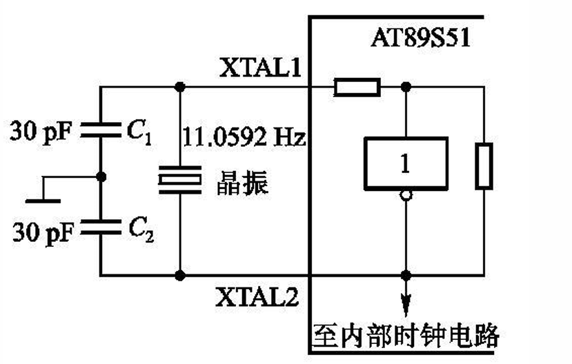
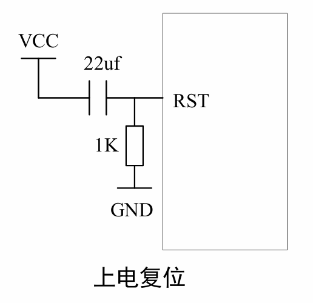
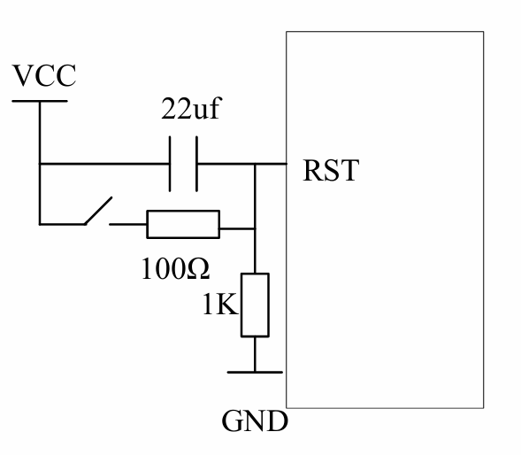

## 目录

- [硬件结构](#硬件结构)
- [引脚功能](#引脚功能)
- [CPU](#cpu)
- [存储器结构](#存储器结构)
- [时钟电路与时序](#时钟电路与时序)
- [复位](#复位)
- [功耗模式](#功耗模式)
- [51单片机最小系统](#51单片机最小系统)
- [习题](#习题)

>注意：16位寄存器只有DPTR和PC两个指针，其他的全为8位

## 硬件结构
1. CPU
    - 8位
2. RAM
    - 片内256B，片外可拓展64KB
3. ROM
    - 片内4KB,可拓展至64KB
4. TIM/CNT
    - 3个16位定时器
5. 中断System
    - 6个中断源
    - 2级别
6. USB
    - 全双工
7. IO
    - 4*8，P0-P3
8. SFR（特殊功能寄存器）
    - 26个
    - 80~FF
9. 看门狗
    - 1个

---

## 引脚功能
1. 电源引脚
    - VCC
    - GND
2. 时钟引脚
    - XTAL1（片外时钟源输入端）
    - XTAL2（片内时钟源输出端）
3. 控制引脚
    - RST（复位引脚reset）
    - EA（Vpp）
        - EA=1,读取完片内ROM后，自动读取片外ROM
        - EA=0,只读取片外ROM
        - Vpp，对片外ROM编程（第二功能）
    - ALE(PROG)
        - 正常情况，作为一个小的时钟来用，固定输出f/6
        - 特殊情况，输出高电平时，将地址锁存器的数据传出去，跳变至低电平时锁地址数据
        - PROG，对片内ROM编程
    - PSEN
        - 访问片外ROM的标志位
4. IO引脚
    1. P0
        - 字节地址：80H
        - 位地址：80H~87H
        - 低八位地址/数据总线
        - 双向口，每个引脚可以驱动8个74LS
        - 接上拉电阻时，作为准双向口
        - 编程片内ROM，接收代码
    2. P1
        - 字节地址：90H
        - 位地址：90H~97H
        - 准双向口，可驱动4个74LS
        - P1.0
            - TIM2输入端
        - P1.1
            - TIM2IC端，输入捕获
        - P1.5/p1.6 
            - MOSI对片内ROM编程和校验
        - P1.7
            - 将代码烧录进片内ROM
    3. P2
        - 字节地址：P0H
        - 位地址；A0H~A7H
        - 准双向口，驱动4个74LS
        - 访问片外ROM，作为高8位地址总线
    4. P3
        - 字节地址：B0H
        - 位地址：B0H~B7H
        - 准双向口，驱动4个74LS
        - P3.0
            - RX,USB接收引脚
        - P3.1
            - TX,USB输出引脚
        - P3.2
            - INT0,外部中断1
        - P3.3
            - INT1,外部中断2
        - P3.4
            - T0,TIM0输入
        - P3.5
            - T1,TIM1输入
        - P3.6
            - WR，外部RAM写
        - P3.7
            - RD，外部RAM读

---

## CPU
1. ALU
2. A ->加减法寄存器
    - 字节地址：E0H
    - 位地址：E0-E7H
3. B ->乘除法寄存器 
    ### B寄存器
    - 数据存放在A,B，B放置结果高八位，A存放结果低八位
4. PSW
    >C51内置的统一状态自动管理器
    - 地址起始D0
    - PSW.7 -> Cy进位标志位
    - PSW.6 -> AC进位标志位
        - 用于BCD码计算十进制自动校准
    - PSW.5 -> F0程序流向用户指定标志位
    - PSW.4 -> RS1
    - PSW.3 -> RS0
        - RS1,RS0组合2*2种寄存器存放区
    - PSW.2 -> OV运算溢出标志位标志位
    - PSW.1 -> 无用
    - PSW.0 -> P奇偶校验标志位，判断A寄存器中奇数个数
5. DPTR0/1 
    - RAM指针，指向数据地址
    - SP：片内RAM堆栈指针
    - DPTR：片外RAM指针
6. PC
    - 程序指针，复位时指向0000H
    - 程序指针，指向程序的下一条的位置
    - 执行子程序需要压栈

---

## 存储器结构
1. ROM
    - 内置8KB的ROM
    - 可外扩64KB的ROM
### 中断源锚点
    - 读取范围由EA引脚控制
    - 外部中断地址：

        |中断源|入口地址|
        |---|---|
        |INT0|0003H|
        |TIM0|000BH|
        |INT1|0013H|
        |TIM1|001BH|
        |USAT|0026H|
        |TIM2|002BH|

2. RAM
    ### 空间换算
    - 1K=2^10B
    - 2K=2^11B
    - 64K=2^16=65536B=FFFFH
    ### 内存结构
    - 片内RAM:256B
    - 片外RAM:64KB=65536B
    - 片内RAM分为四个区域：通用寄存器区，位寻址区，用户RAM区，SFR区
    ### 片内RAM内存分配
    - 00H~FFH                               256
    - 00H~1FH ->4个通用工作寄存器区          32（每8个为一个寄存器R0~R7,R=register）        ->数据中转站
    - 20H~2FH ->128位寻址区                 16（16*8=128位，每一位都可以作为一个0/1）       ->0/1状态管理,只有这里支持位寻址
    - 30H~7FH ->用户RAM区                   80（随便用，但是不能位寻址）                    ->存变量，数组，缓存，堆栈
    - 80H~FFH ->SFR区（用户RAM区）          128（32个特殊寄存器，所有功能的寄存器）          ->单片机状态总控
    ### 四区寻址方式
    - 特殊：字节寻址
    - 用户：字节寻址
    - 位区：位寻址+字节寻址
    - 通用：字节寻址

3. SFR
    - 80H~FFH
    - 32个特殊寄存器
    1. 堆栈指针SP
        - 先进后出
        - 复位地址：07H
        - 作用：保护断点，保护现场
        - POP,PUSH（出栈，压栈）
    2. B寄存器 
        - [B寄存器](#b寄存器)
    3. AUXR寄存器
        - AUXR.0 ->DISALE
            - ALE使能标志位
        - AUXR.3 ->DISRTO
            - 看门狗溢出复位使能标志位
        - AUXR.4 ->WDIDLE
            - 空闲模式看门狗使能标志位
    4. AUXR1寄存器
        - AUXR1.0 ->DPS
            - DPTR0/DPTR1指针选择标志位
            - 0 -> DPTR0
            - 1 -> DPTR1
    5. 看门狗寄存器
        - CNT+复位
4. 位地址 
    - RAM+SFR
    - 00H~FFH
        - 00H~7FH ->RAM（20H~2FH）
        - 80H~FFH ->SFR

---

## 时钟电路与时序
1. 时钟周期
    - 震荡周期：T=1/f
    - f为时钟震荡频率
2. 机械周期
    - 每12个时钟周期为一个机械周期
3. 指令周期
    - 执行一条指令可能需要n个机械周期
        - 单机械周期指令
        - 双机械周期指令
        - 四机械周期指令
4. 时钟设计
    - 晶振周期通常是1.2~24MHz，f越高，计算越快
    - C1和C2通常是30μF
    - 接外部时钟时，直接接到XTAL1,XTAL2悬空
    - 电路图：
    
5. 时序
    - 地址锁存信号：T=6/f
    - 初始化信号：RST引脚高电平>2*机械周期

---

## 复位
1. 复位变化
    - PC -> 0000H
    - SP -> 07H
    - RAM和SFR清空
    -  P0~P3高电位
2. 复位电路
    - 上电自动复位
    
    - 按钮复位
    

---

## 功耗模式
1. 功耗模式
    - IDL=1
2. 空闲模式
    - PD=1

>三种模式
    - 运行模式，正常状态
    - 空闲模式：CPU停止工作，时钟和中断继续
    - 掉电模式：只有RAM和SFR保持数据，其他全部停止

    - 断电（不是工作模式）：全部停止工作，RAM数据丢失

---

## 51单片机最小系统
>C51+外部时钟+复位电路

---

## 习题
### 课件
1. R0-R3通用存储器
    >注意不是R1-R4
2. 字节地址与位地址书写相同，使用时是否会出现问题
    >不会，指令不同

### 填空
1. 频率周期换算
    - f已知
    - T=1/f，T机械=12T
2. 频率周期换算
    - C51的机械周期=12*时钟震荡周期
3. 位地址与字节地址转换
    - 分类：位寻址区：20H+（位/8）  和   sfr区
    - 1）20H+4*16/8=28H
    - 2）20H+（8*16+8）/8=31H>2FH
    >在做这类题时超过80H就不同了
    >超过80H进入SFR寄存器区，字节地址=位地址区&0F8H
    >SFR区，可位寻址的寄存器，字节地址=位地址区
4. 位地址与字节地址转换
    - 2AH < 2FH,10*8/16=5 -> 50H
    - A8H > 2FH,A8H
5. P标志位
    >判断A寄存器的奇数偶数个数
    - 0110 0011 偶数，P=0
6. RS寄存器
    >RS（PSW.3/PSW.4）控制4组寄存器的选择，和BCD码一样的规则
    - R0~R7 00H~07H
    - PSW复位00H
    - PSW复位，00，导致RS=00，所以为第一组寄存器
7. RS寄存器
    - 00H~1FH
8. PC以及子程序调用
    > PC指针调用，先入栈低8位PCL,再入栈高8位PCH
    > PC指针用于指向当前程序运行位置
    > 相当于每一段程序占用一段内存，PC指针用于指向当前程序的地址，如果调用子程序，需要把当前程序执行地址压栈，执行完子程序再出栈
    - 调用子程序时，先（将PC的内容压栈），待程序执行结束，再（让PC的内容出栈），先弹出（高位）
9. PC以及子程序调用
    >PC指针为16位寄存器
    >寻址范围：2^16，65536，65536/1024=64KB
10. 复位
    P0-93：高电平
11. 时钟XTAL
    >当采用外部时钟源时：
    - XTAL1:接时钟源
    - XTAL2:悬空
12. 复位
    - SP指针：07H
    - PC指针：0000H
### 单选
1. PC以及子程序的调用
    - PC指针当前的值为当前正在执行指令的下一条指令的首地址    
    - PC不可寻址
2. 
    - 主频高，运算块
### 判断
1. EA状态判断
    - ×，外扩大小是60KB
2. 区分ROM和RAM
    - ×
3. IO口工作状态
    - √， 欲使IO口工作在输入状态，需要预置1
4. PC以及子程序的调用
    - √，PC是ROM的指针，sp是RAM的指针
5. SFR
    - √，SFR这一部分的地址与用户RAM重合
6. 位寻址区
    - ×，位寻址区既可以用位寻址，也可以字节寻址，位寻址：20H.0,字节寻址：20H
7. SFR
    - ×，SFR是部分位寻址
8. 堆栈区
    - ×，堆栈属于RAM,利用指针来设置堆栈区
    >设置SP指针注意避开其他三个区域，在用户RAM区域设置SP指针
9. 模式
    - √，空闲模式特征：CPU停止工作，时钟和中断系统继续，中断系统可以唤醒CPU继续工作
10. 模式
    - √，两种模式下，都不会丢失RAM和SFR的数据
11. 模式
    - √，掉电模式，只保留数据，其他不工作
12. 模式
    - √，几种模式都可以响应中断
### 简答题
1. 硬件结构
    - CPU,RAM,ROM,SFR,IO,时钟，外部中断，看门狗定时器
    - 传送：[硬件结构](#硬件结构)
2. 中断源地址
    - 传送：[中断源地址](#中断源锚点)
3. EA
    - EA=0,只能访问片外存储器
    - EA=1,先访问片内存储器，当PC指针超出片内存储器范围，访问片外存储器
4. 模式
    - 空闲模式 ->CPU不工作，时钟和中断工作
    - 掉电模式 ->除了保存数据，都不工作
5. 看门狗
    - 看门狗是一个计数器，当程序异常跑飞时，溢出，触发复位