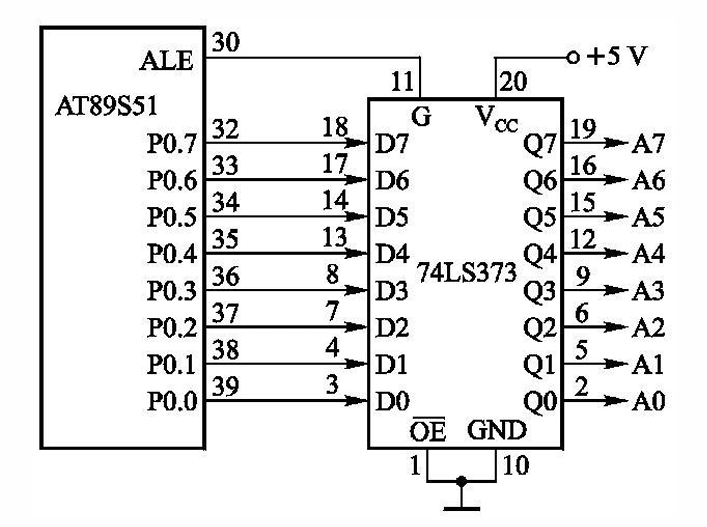
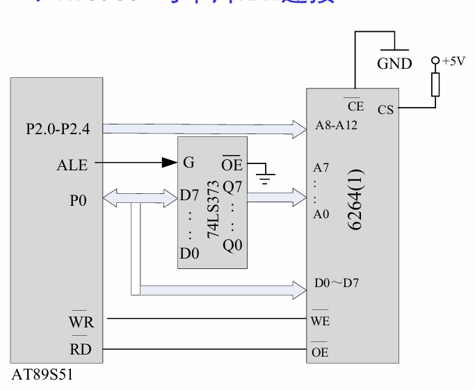

## 总线结构
1. 地址总线
    - P0:低8位地址线
    - P2:高8位地址线
2. 数据总线
    - P0:数据线
3. 控制总线
    - PSEN
    - RD/WR
    - ALE
    - EA
## 外拓芯片
1. 74LS373
    - D7~D0:8位数据输入线
    - Q7~Q0:8位数据输出线
    - OE:数据输入允许位 -> 低电平有效
    - G:数据输入锁存引脚
    - 接线
        - G接ALE
        - P接D
        - OE接GND
    - 接线图
        
2. 6264
    - 8KB
    - A0~A15:地址输入线
    - D0~D7:双向三态数据线
    - CE:片选信号输入线
    - OE:读允许引脚
    - WE:写允许引脚
    - 接线图：
        
    - 读写
>写6264
```asm
ORG 0000H
MAIN:
    MOV R0,#20H             ;内部地址
    MOV DPTR,#0000H         ;外部地址
    MOV R7,#16              ;循环次数

LOOP:
    MOV A,@R0               ;内外通过A传递数据
    MOV @DPTR,A             ;
    INC R0                  ;内地址+1
    INC DPTR                ;外地址+1
    DJNZ R7,LOOP            ;循环16次
    SJMP $
    END
``` 
>读6264(反向传递数据就行)
```asm
ORG 0000H
MAIN:
    MOV R0,#20H             ;内部地址
    MOV DPTR,#0000H         ;外部地址
    MOV R7,#16              ;循环次数

LOOP:
    MOV A,@DPTR             ;外部地址传递数据
    MOV @R0,A               ;内部地址接收数据
    INC R0                  ;内地址+1
    INC DPTR                ;外地址+1
    DJNZ R7,LOOP            ;循环16次
    SJMP $
    END
```   
3. 分类
- ROM       -> 只读存储器
- PROM      -> 一次可编程ROM
- EPROM     -> 紫外线可编程ROM
- EEPROM    -> 电信号可编程ROM
- FLASH     -> 闪存,读写速度快