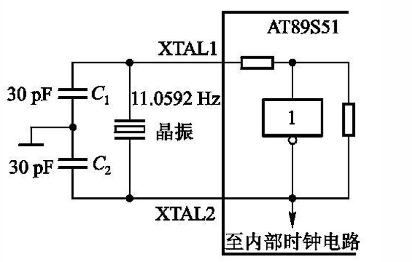
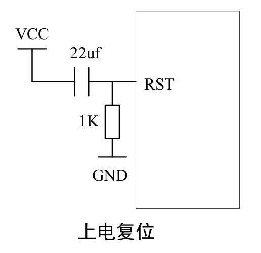
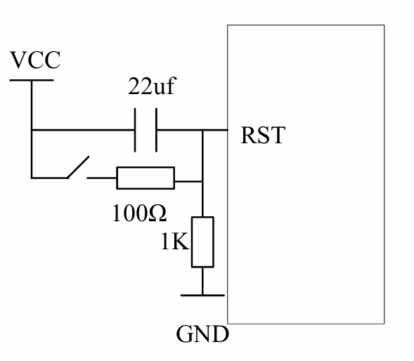

## 目录

- [硬件结构](#硬件结构)
- [引脚功能](#引脚功能)
- [CPU](#cpu)
- [存储器结构](#存储器结构)
- [时钟电路与时序](#时钟电路与时序)
- [复位](#复位)
- [功耗模式](#功耗模式)
- [51单片机最小系统](#51单片机最小系统)
- [习题](#习题)

> 注意：16位寄存器只有DPTR和PC两个指针，其他的全为8位

---

## 硬件结构

| 组件 | 说明 |
|------|------|
| CPU | 8位 |
| RAM | 片内256B，片外可拓展64KB |
| ROM | 片内4KB，可拓展至64KB |
| TIM/CNT | 3个16位定时器 |
| 中断System | 6个中断源，2级别 |
| USB | 全双工 |
| IO | 4\*8，P0-P3 |
| SFR（特殊功能寄存器） | 26个，80~FF |
| 看门狗 | 1个 |

---

## 引脚功能

### 电源引脚

| 引脚 | 说明 |
|------|------|
| VCC | 电源正极 |
| GND | 电源地 |

### 时钟引脚

| 引脚 | 说明 |
|------|------|
| XTAL1 | 片外时钟源输入端 |
| XTAL2 | 片内时钟源输出端 |

### 控制引脚

| 引脚 | 说明 |
|------|------|
| RST | 复位引脚（reset） |
| EA（Vpp） | EA=1，读取完片内ROM后，自动读取片外ROM；EA=0，只读取片外ROM；Vpp，对片外ROM编程（第二功能） |
| ALE（PROG） | 正常情况，作为一个小的时钟来用，固定输出 f/6；特殊情况，输出高电平时，将地址锁存器的数据传出去，跳变至低电平时锁地址数据；PROG，对片内ROM编程 |
| PSEN | 访问片外ROM的标志位 |

### IO 引脚

#### P0

| 属性 | 说明 |
|------|------|
| 字节地址 | 80H |
| 位地址 | 80H~87H |
| 功能 | 低八位地址/数据总线 |
| 特性 | 双向口，每个引脚可以驱动8个74LS |
| 备注 | 接上拉电阻时，作为准双向口；编程片内ROM，接收代码 |

#### P1

| 属性 | 说明 |
|------|------|
| 字节地址 | 90H |
| 位地址 | 90H~97H |
| 特性 | 准双向口，可驱动4个74LS |

子引脚功能：

| 引脚 | 功能 |
|------|------|
| P1.0 | TIM2输入端 |
| P1.1 | TIM2IC端，输入捕获 |
| P1.5/P1.6 | MOSI，对片内ROM编程和校验 |
| P1.7 | 将代码烧录进片内ROM |

#### P2

| 属性 | 说明 |
|------|------|
| 字节地址 | A0H |
| 位地址 | A0H~A7H |
| 特性 | 准双向口，驱动4个74LS |
| 功能 | 访问片外ROM，作为高8位地址总线 |

#### P3

| 属性 | 说明 |
|------|------|
| 字节地址 | B0H |
| 位地址 | B0H~B7H |
| 特性 | 准双向口，驱动4个74LS |

子引脚功能：

| 引脚 | 功能 |
|------|------|
| P3.0 | RX，USB接收引脚 |
| P3.1 | TX，USB输出引脚 |
| P3.2 | INT0，外部中断1 |
| P3.3 | INT1，外部中断2 |
| P3.4 | T0，TIM0输入 |
| P3.5 | T1，TIM1输入 |
| P3.6 | WR，外部RAM写 |
| P3.7 | RD，外部RAM读 |

---

## CPU

### ALU
算术逻辑单元

### A 寄存器（加减法寄存器）

| 属性 | 说明 |
|------|------|
| 字节地址 | E0H |
| 位地址 | E0H~E7H |

### B 寄存器（乘除法寄存器）

> 数据存放在A、B，B放置结果高八位，A存放结果低八位

### PSW（程序状态字）

> C51内置的统一状态自动管理器

| 位 | 标识 | 说明 |
|----|------|------|
| PSW.7 | Cy | 进位标志位 |
| PSW.6 | AC | 辅助进位标志位，用于BCD码计算十进制自动校准 |
| PSW.5 | F0 | 程序流向用户指定标志位 |
| PSW.4 | RS1 | 寄存器区选择位1 |
| PSW.3 | RS0 | 寄存器区选择位0 |
| PSW.2 | OV | 运算溢出标志位 |
| PSW.1 | - | 无用 |
| PSW.0 | P | 奇偶校验标志位，判断A寄存器中奇数个数 |

> RS1、RS0组合：2\*2种寄存器存放区

### DPTR0/1

| 指针 | 说明 |
|------|------|
| SP | 片内RAM堆栈指针 |
| DPTR | 片外RAM指针，指向数据地址 |

### PC（程序计数器）

- 程序指针，复位时指向0000H
- 指向程序的下一条指令的位置
- 执行子程序需要压栈

---

## 存储器结构

### ROM

| 属性 | 说明 |
|------|------|
| 内置 | 8KB |
| 外扩 | 最大64KB |
| 读取范围 | 由EA引脚控制 |

### 中断源入口地址

| 中断源 | 入口地址 |
|--------|----------|
| INT0 | 0003H |
| TIM0 | 000BH |
| INT1 | 0013H |
| TIM1 | 001BH |
| USAT | 0026H |
| TIM2 | 002BH |

### RAM

> 空间换算：1K=2^10B，2K=2^11B，64K=2^16=65536B=FFFFH

| 属性 | 说明 |
|------|------|
| 片内RAM | 256B |
| 片外RAM | 64KB=65536B |

> 片内RAM分为四个区域：通用寄存器区，位寻址区，用户RAM区，SFR区

### 片内RAM内存分配

| 地址范围 | 大小 | 区域 | 说明 |
|----------|------|------|------|
| 00H~1FH | 32B | 4个通用工作寄存器区 | 每8个为一个寄存器R0~R7，数据中转站 |
| 20H~2FH | 16B | 128位寻址区 | 16\*8=128位，每一位都可以作为一个0/1，用于0/1状态管理，只有这里支持位寻址 |
| 30H~7FH | 80B | 用户RAM区 | 随便用，但不能位寻址，存变量、数组、缓存、堆栈 |
| 80H~FFH | 128B | SFR区（特殊功能寄存器区） | 32个特殊寄存器，单片机状态总控 |

### 四区寻址方式

| 区域 | 寻址方式 |
|------|----------|
| 通用寄存器区 | 字节寻址 |
| 位寻址区 | 位寻址 + 字节寻址 |
| 用户RAM区 | 字节寻址 |
| SFR区 | 字节寻址 |

### SFR（特殊功能寄存器）

地址范围：80H~FFH，共32个特殊寄存器

#### 堆栈指针 SP

| 属性 | 说明 |
|------|------|
| 特性 | 先进后出 |
| 复位地址 | 07H |
| 作用 | 保护断点，保护现场 |
| 操作 | POP（出栈），PUSH（压栈） |

#### B 寄存器

参见 [B 寄存器](#b-寄存器)

#### AUXR 寄存器

| 位 | 标识 | 说明 |
|----|------|------|
| AUXR.0 | DISALE | ALE使能标志位 |
| AUXR.3 | DISRTO | 看门狗溢出复位使能标志位 |
| AUXR.4 | WDIDLE | 空闲模式看门狗使能标志位 |

#### AUXR1 寄存器

| 位 | 标识 | 说明 |
|----|------|------|
| AUXR1.0 | DPS | DPTR0/DPTR1指针选择标志位；0 -> DPTR0，1 -> DPTR1 |

#### 看门狗寄存器

- CNT + 复位

### 位地址

| 范围 | 说明 |
|------|------|
| 00H~7FH | RAM（20H~2FH） |
| 80H~FFH | SFR |

> 位地址范围：RAM + SFR = 00H~FFH

---

## 时钟电路与时序

| 概念 | 说明 |
|------|------|
| 时钟周期 | 震荡周期：T=1/f，f为时钟震荡频率 |
| 机械周期 | 每12个时钟周期为一个机械周期 |
| 指令周期 | 执行一条指令可能需要n个机械周期（单/双/四机械周期指令） |

### 时钟设计

- 晶振周期通常是1.2~24MHz，f越高，计算越快
- C1和C2通常是30μF
- 接外部时钟时，直接接到XTAL1，XTAL2悬空
- 电路图：
  

### 时序

| 信号 | 说明 |
|------|------|
| 地址锁存信号 | T=6/f |
| 初始化信号 | RST引脚高电平 > 2\*机械周期 |

---

## 复位

### 复位变化

| 项目 | 变化 |
|------|------|
| PC | -> 0000H |
| SP | -> 07H |
| RAM和SFR | 清空 |
| P0~P3 | 高电位 |

### 复位电路

- 上电自动复位
  
- 按钮复位
  

---

## 功耗模式

| 模式 | 寄存器位 | 说明 |
|------|----------|------|
| 空闲模式 | IDL=1 | CPU停止工作，时钟和中断继续 |
| 掉电模式 | PD=1 | 只有RAM和SFR保持数据，其他全部停止 |

> 三种模式：
> - 运行模式，正常状态
> - 空闲模式：CPU停止工作，时钟和中断继续
> - 掉电模式：只有RAM和SFR保持数据，其他全部停止
> 
> 断电（不是工作模式）：全部停止工作，RAM数据丢失

---

## 51单片机最小系统

> C51 + 外部时钟 + 复位电路

---

## 习题

### 课件

1. R0-R3通用存储器
   > 注意不是R1-R4
2. 字节地址与位地址书写相同，使用时是否会出现问题
   > 不会，指令不同

### 填空

1. 频率周期换算
   - f已知
   - T=1/f，T机械=12T
2. 频率周期换算
   - C51的机械周期=12\*时钟震荡周期
3. 位地址与字节地址转换
   - 分类：位寻址区：20H+（位/8）和 sfr区
   - 1) 20H+4\*16/8=28H
   - 2) 20H+（8\*16+8）/8=31H>2FH
   > 在做这类题时超过80H就不同了
   > 超过80H进入SFR寄存器区，字节地址=位地址区&0F8H
   > SFR区，可位寻址的寄存器，字节地址=位地址区
4. 位地址与字节地址转换
   - 2AH < 2FH, 10\*8/16=5 -> 50H
   - A8H > 2FH, A8H
5. P标志位
   > 判断A寄存器的奇数偶数个数
   - 0110 0011 偶数，P=0
6. RS寄存器
   > RS（PSW.3/PSW.4）控制4组寄存器的选择，和BCD码一样的规则
   - R0~R7 00H~07H
   - PSW复位00H
   - PSW复位，00，导致RS=00，所以为第一组寄存器
7. RS寄存器
   - 00H~1FH
8. PC以及子程序调用
   > PC指针调用，先入栈低8位PCL，再入栈高8位PCH
   > PC指针用于指向当前程序运行位置
   > 相当于每一段程序占用一段内存，PC指针用于指向当前程序的地址，如果调用子程序，需要把当前程序执行地址压栈，执行完子程序再出栈
   - 调用子程序时，先（将PC的内容压栈），待程序执行结束，再（让PC的内容出栈），先弹出（高位）
9. PC以及子程序调用
   > PC指针为16位寄存器
   > 寻址范围：2^16，65536，65536/1024=64KB
10. 复位
    - P0-93：高电平
11. 时钟XTAL
    > 当采用外部时钟源时：
    - XTAL1：接时钟源
    - XTAL2：悬空
12. 复位
    - SP指针：07H
    - PC指针：0000H

### 单选

1. PC以及子程序的调用
   - PC指针当前的值为当前正在执行指令的下一条指令的首地址
   - PC不可寻址
2. 主频高，运算快

### 判断

1. EA状态判断
   - x，外扩大小是60KB
2. 区分ROM和RAM
   - x
3. IO口工作状态
   - √，欲使IO口工作在输入状态，需要预置1
4. PC以及子程序的调用
   - √，PC是ROM的指针，sp是RAM的指针
5. SFR
   - √，SFR这一部分的地址与用户RAM重合
6. 位寻址区
   - x，位寻址区既可以用位寻址，也可以字节寻址，位寻址：20H.0，字节寻址：20H
7. SFR
   - x，SFR是部分位寻址
8. 堆栈区
   - x，堆栈属于RAM，利用指针来设置堆栈区
   > 设置SP指针注意避开其他三个区域，在用户RAM区域设置SP指针
9. 模式
   - √，空闲模式特征：CPU停止工作，时钟和中断系统继续，中断系统可以唤醒CPU继续工作
10. 模式
    - √，两种模式下，都不会丢失RAM和SFR的数据
11. 模式
    - √，掉电模式，只保留数据，其他不工作
12. 模式
    - √，几种模式都可以响应中断

### 简答题

1. 硬件结构
   - CPU,RAM,ROM,SFR,IO,时钟，外部中断，看门狗定时器
   - 传送：[硬件结构](#硬件结构)
2. 中断源地址
   - 传送：[中断源地址](#中断源入口地址)
3. EA
   - EA=0，只能访问片外存储器
   - EA=1，先访问片内存储器，当PC指针超出片内存储器范围，访问片外存储器
4. 模式
   - 空闲模式 -> CPU不工作，时钟和中断工作
   - 掉电模式 -> 除了保存数据，都不工作
5. 看门狗
   - 看门狗是一个计数器，当程序异常跑飞时，溢出，触发复位