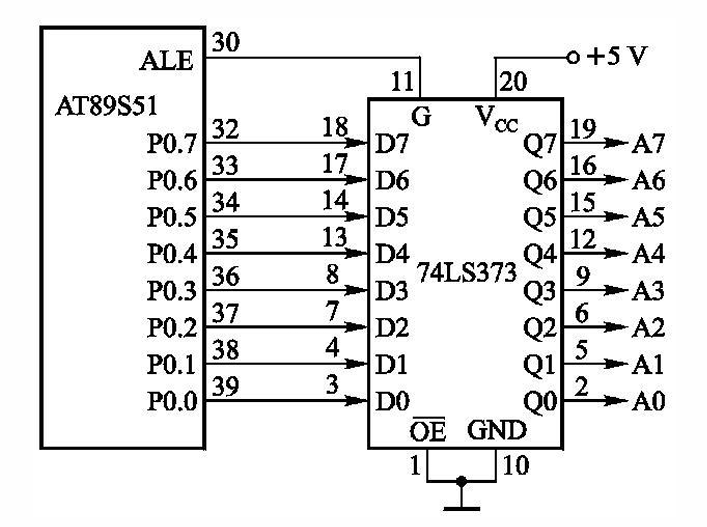
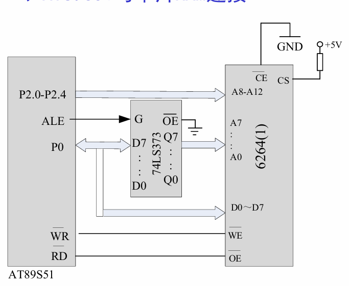

## 总线结构

| 总线类型 | 说明 |
|----------|------|
| 地址总线 | P0：低8位地址线；P2：高8位地址线 |
| 数据总线 | P0：数据线 |
| 控制总线 | PSEN、RD/WR、ALE、EA |

---

## 外拓芯片

### 74LS373 锁存器

| 引脚 | 说明 |
|------|------|
| D7~D0 | 8位数据输入线 |
| Q7~Q0 | 8位数据输出线 |
| OE | 数据输入允许位，低电平有效 |
| G | 数据输入锁存引脚 |

**接线方式：**
- G 接 ALE
- P 接 D
- OE 接 GND

**接线图：**


### 6264 外部RAM

| 属性 | 说明 |
|------|------|
| 容量 | 8KB |
| A0~A15 | 地址输入线 |
| D0~D7 | 双向三态数据线 |
| CE | 片选信号输入线 |
| OE | 读允许引脚 |
| WE | 写允许引脚 |

**接线图：**


#### 写 6264

```asm
ORG 0000H
MAIN:
    MOV R0,#20H             ; 内部地址
    MOV DPTR,#0000H         ; 外部地址
    MOV R7,#16              ; 循环次数

LOOP:
    MOV A,@R0               ; 内外通过A传递数据
    MOV @DPTR,A             ;
    INC R0                  ; 内地址+1
    INC DPTR                ; 外地址+1
    DJNZ R7,LOOP            ; 循环16次
    SJMP $
    END
```

#### 读 6264（反向传递数据即可）

```asm
ORG 0000H
MAIN:
    MOV R0,#20H             ; 内部地址
    MOV DPTR,#0000H         ; 外部地址
    MOV R7,#16              ; 循环次数

LOOP:
    MOV A,@DPTR             ; 外部地址传递数据
    MOV @R0,A               ; 内部地址接收数据
    INC R0                  ; 内地址+1
    INC DPTR                ; 外地址+1
    DJNZ R7,LOOP            ; 循环16次
    SJMP $
    END
```

---

## 存储器分类

| 类型 | 说明 |
|------|------|
| ROM | 只读存储器 |
| PROM | 一次可编程ROM |
| EPROM | 紫外线可编程ROM |
| EEPROM | 电信号可编程ROM |
| FLASH | 闪存，读写速度快 |